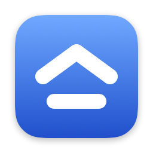
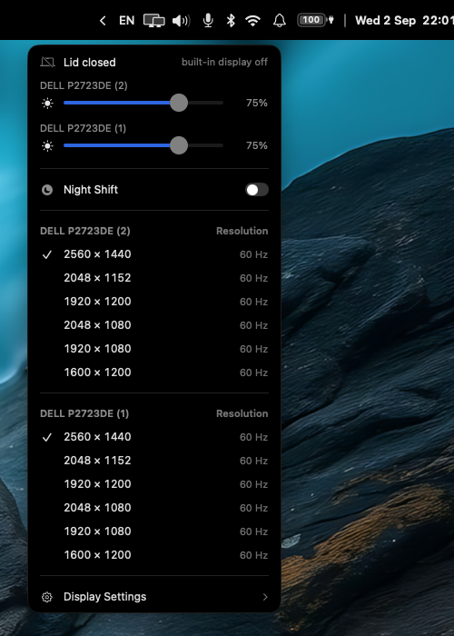

<div align="center">



# Stege

**A macOS menu bar replacement, with `AeroSpace` and `yabai` support.**

Your window manager's workspaces, the frontmost application's menus, and the
usual status widgets, in a panel that replaces the system menu bar.

The name is Greek: *στέγη*, *stégi*, the roof. The shelter over everything
beneath it, which is what a menu bar is.

</div>


## Install

```bash
brew tap xrhstosmour/stege
brew install --cask stege
```

Then hide the system menu bar: **System Settings → Control Center → Automatically
hide and show the menu bar → Always**.

Stege is signed with a self-signed certificate rather than an Apple Developer ID,
so it cannot be notarised. What stands in for that is Homebrew's `sha256` check
and a build provenance attestation on every release, so the archive traces back
to the commit and workflow that produced it:

```bash
gh attestation verify Stege.zip --repo xrhstosmour/stege
```

## Configure

Stege reads `~/.config/stege/config.toml`. The file is watched, so saving it
applies immediately with no restart.

```bash
mkdir -p ~/.config/stege
curl -o ~/.config/stege/config.toml \
  https://raw.githubusercontent.com/xrhstosmour/stege/main/example/config.toml
```

[**`example/config.toml`**](example/config.toml) is the reference. Every setting
is in it, with the values it accepts written above it. This file deliberately
does not repeat them.

The shape of it:

```toml
theme = "system"                 # system, light, dark

[widgets]
displayed = [                    # the bar, left to right
    "default.appleMenu", "default.spaces", "default.applicationMenu",
    "spacer",
    "default.reveal", "default.display", "default.audio",
    "default.bluetooth", "default.network", "default.battery",
    "divider", "default.notifications", "default.time",
]

[widgets.default.battery]        # each widget's own table
style = "inside"

[bar.foreground]                 # the bar itself
height = "menu-bar"
```

Three optional shortcuts: `toggle-shortcut` hides and shows the bar,
`reveal-shortcut` appends the other applications' status items,
`menu-shortcut` opens the frontmost application's first menu.

## What it does

**Workspaces** from `AeroSpace` or `yabai`, with an icon per window, each bar
showing only its own display's.

**The frontmost application's menus**, drawn in the bar and opened as real
`NSMenu`s, so arrows, Return, Escape and type-select all work.

**The other applications' status items**, appended behind a chevron and read
through the Accessibility API rather than photographed, so it needs no Screen
Recording. Right-click one to hide it for good.

**Sound**, with what is playing underneath it.


**The screen**: a brightness slider per display, spoken to over DDC/CI on
external monitors so it moves the real backlight, the resolution and refresh rate
of each, Night Shift and True Tone. It says when the lid is shut.



**The battery**, with health, cycle count and Low Power Mode.


**The clock and calendar**, with the month and the day's events.


**Wi-Fi**, **Bluetooth**, **notifications and Focus**, **updates waiting**, **CPU
and memory**, **the input source**, and **microphone and camera in-use
indicators**.

## Permissions

Asked for only when a widget you have enabled needs one. A window at first launch
lists whatever is still missing.

| Permission | Needed for |
| --- | --- |
| Accessibility | The application menus, the Apple menu, the appended status items |
| Bluetooth | The Bluetooth widget |
| Location | The Wi-Fi network name |
| Calendars | Events in the clock and calendar popup |
| Automation | Reading `Spotify` and `Music` for what is playing |

## Privacy

No telemetry, no self-updater, and one outbound request: album artwork, fetched
from the player's own servers only when the sound popup is open on a track whose
player gave a link rather than the image. `fetch-artwork = false` refuses even
that.

## Known limitations

- **Low Power Mode and Focus flash the system panel.** Nothing else can write
  those settings: `pmset` needs root, `~/Library/DoNotDisturb/DB` needs Full Disk
  Access, and the private frameworks answer only callers holding an Apple-issued
  entitlement.
- **Notifications are only read when asked.** Reading the list means opening
  Notification Center, so Stege never does it on its own. Banners are folded in
  as they arrive; the refresh arrow reads the rest.
- **AirPlay is handed to macOS.** The receiver list is behind an Apple-only
  entitlement, so the sound and display popups open Control Center's own picker
  rather than drawing a list they cannot fill. A receiver already connected is an
  ordinary output device and is listed and selectable like any other.
- **No screen recording indicator.** No public API detects another application
  capturing the screen.
- **An external monitor may not answer DDC**, in which case it is listed without
  a brightness slider rather than given one that does nothing.

## Forked from barik

A fork of [`barik`](https://github.com/mocki-toki/barik) by Simon Butenko, whose
author stopped maintaining it and suggested people fork it. This fork keeps the
look and changes three things: it refreshes on window manager events instead of
polling four times a second, it has no self-updater, and it draws the frontmost
application's menus.

## Contributing

[`AGENTS.md`](AGENTS.md) has the conventions, how to verify a change without
Xcode, and the merge and release workflow. `cd Tests && swift test`.

## Credits

`barik` by [Simon Butenko](https://github.com/mocki-toki), MIT. Widget ideas from
[`barik-enhanced`](https://github.com/MateoCerquetella/barik-enhanced) by Mateo
Cerquetella, MIT.

## License

MIT, see [LICENSE](LICENSE). The original copyright notice is kept alongside this
fork's.
