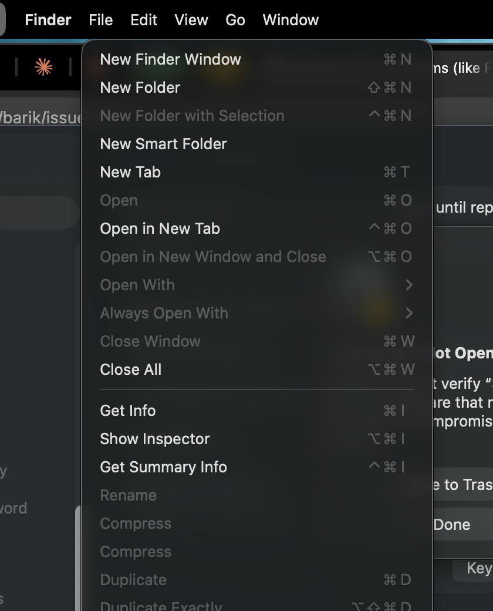
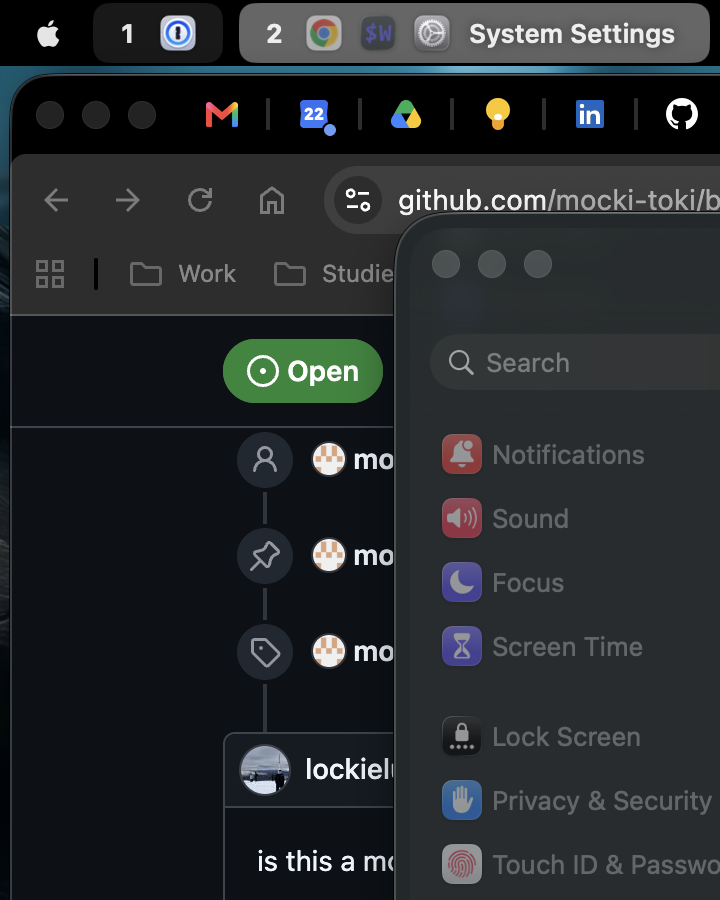
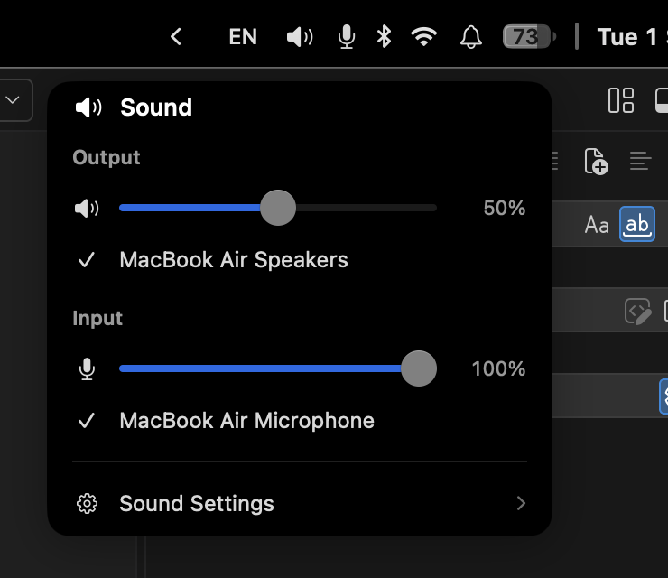
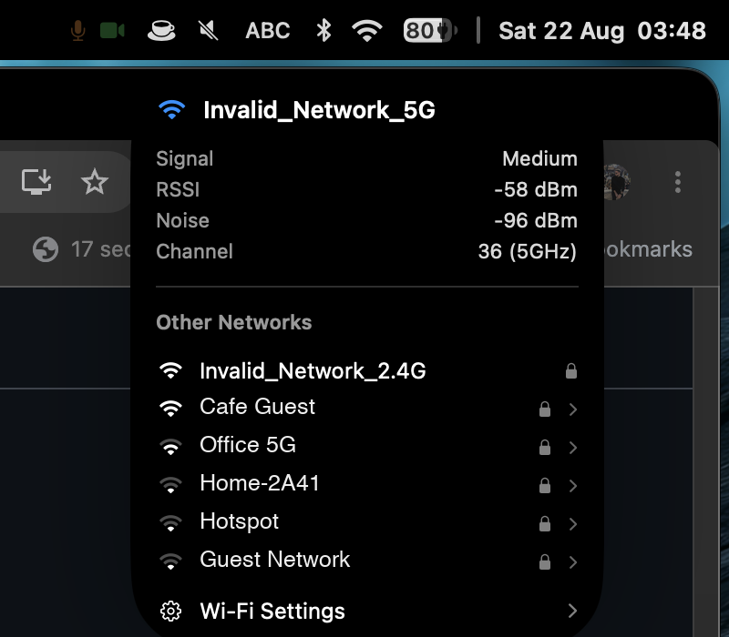
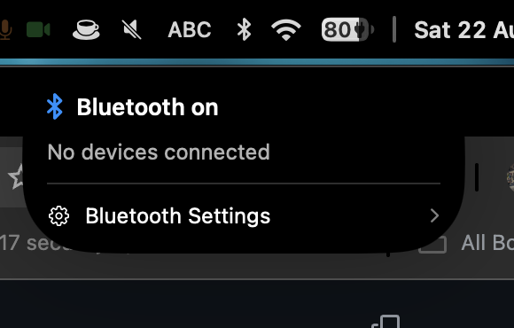
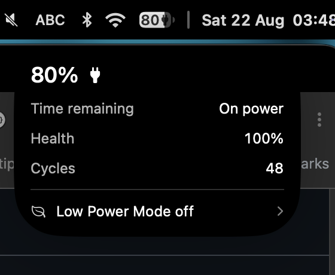
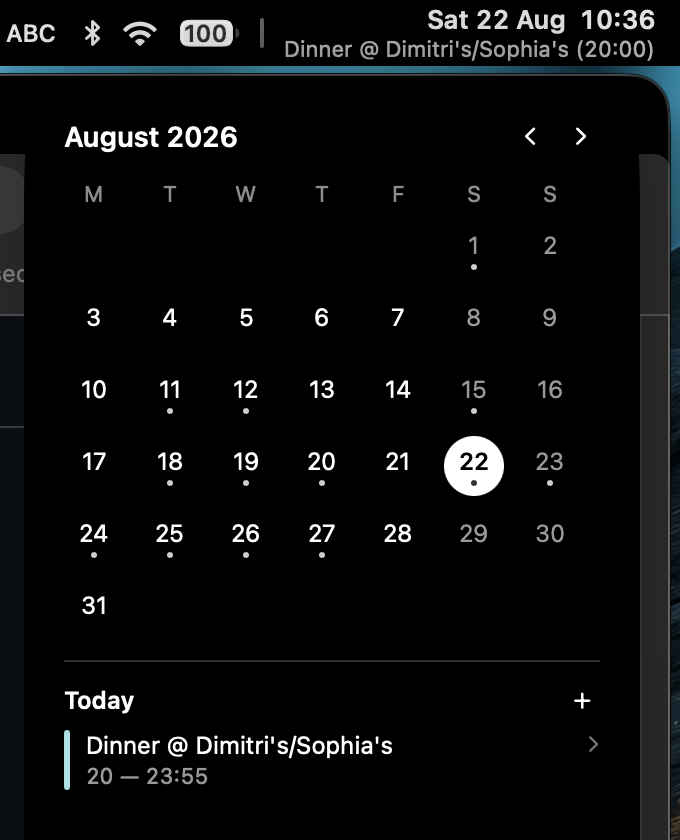

# Stege

A macOS menu bar replacement, with `AeroSpace` and `yabai` support.

Shows your window manager's workspaces, the frontmost app's menus, and the usual status
widgets, in a panel that replaces the system menu bar.

*Stege*, στέγη, is the roof: the shelter over everything beneath it.


## Forked from barik

Stege is a fork of [`barik`](https://github.com/mocki-toki/barik) by Simon Butenko. Its author
[stopped maintaining it](https://github.com/mocki-toki/barik#readme) and suggested people fork
it, so this one does, keeping the look and fixing three things.

**Performance.** Upstream polls the window manager every 0.1 seconds, and each tick spawns
four separate `aerospace` calls. Measured on an M-series laptop, one call costs 14 ms, so the
bar burns around 560 ms of CPU per second, over half a core, permanently. Stege refreshes on
window manager events instead, with one call and a slow safety-net poll.

**Security and privacy.** Upstream's self-updater downloads any `.zip` from a GitHub release
and replaces the app in `/Applications` without checking a code signature. For an app holding
Accessibility permission, a tampered release means a compromised machine. Stege has no
self-updater and installs through Homebrew, which verifies checksums. It makes no outbound
network requests and collects no telemetry.

**App menus.** The frontmost app's menus, File, Edit, View and the rest, drawn in the bar via
the Accessibility API. Prototyped upstream in
[issue #5](https://github.com/mocki-toki/barik/issues/5) but never released.

## Install

```bash
brew tap xrhstosmour/stege
brew install --cask stege
```

Homebrew requires third-party casks to be trusted before install, which the `tap` step
prompts for.

Then hide the system menu bar: System Settings, Control Center, Automatically hide and show
the menu bar, Always.

### Gatekeeper

Stege is signed, but with a self-signed certificate rather than an Apple Developer ID, so it
cannot be notarised without a paid Apple account. On first launch macOS will say
`"Stege.app" Not Opened`. Open System Settings, Privacy & Security, scroll to the bottom and
choose Open Anyway.

What stands in for notarisation is that Homebrew checks the download against the `sha256` in
the cask, and every release is built by GitHub Actions with build provenance attestation, so
the archive can be traced back to the commit and workflow that produced it.

## Permissions

Stege asks for permissions only when a widget you have enabled actually needs one, and a
window at first launch lists whatever is still missing.

| Permission | Needed for | Without it |
| --- | --- | --- |
| Accessibility | Reading and driving the frontmost app's menus, and the Apple menu | The menus are replaced by an "Enable Accessibility" button |
| Bluetooth | The Bluetooth widget | The glyph shows a small lock and opens the settings pane |
| Location | Showing the Wi-Fi network name, and the nearby network list | The name is hidden, everything else still works |
| Calendars | Events in the clock widget and calendar popup | Events are omitted |

Stege is not sandboxed, because the Accessibility API is unavailable to sandboxed apps.

## Configuration

Everything is set in one file. Stege reads `~/.config/stege/config.toml`, falling back to
`~/.stege-config.toml`. The file is watched, so saving it applies immediately with no restart.

[`example/config.toml`](example/config.toml) is a complete, commented copy of every option.
Start from it:

```bash
mkdir -p ~/.config/stege
curl -o ~/.config/stege/config.toml \
  https://raw.githubusercontent.com/xrhstosmour/stege/main/example/config.toml
```

### Choosing what is in the bar

`widgets.displayed` is the bar, left to right. Add an entry to show a widget, remove it to
hide it, reorder the list to move things around.

```toml
theme = "system"          # system, light, dark
hidden = false            # true takes the bar away entirely, see below

[widgets]
displayed = [
    "default.applemenu",
    "default.spaces",
    "default.appmenus",
    "spacer",             # pushes everything after it to the right
    "default.audio",
    "default.battery",
    "divider",            # a thin separator
    "default.time",
]
```

Every widget, and what it shows:

| Widget | Shows |
| --- | --- |
| `default.applemenu` | The Apple logo, opening the real Apple menu |
| `default.spaces` | Window manager workspaces, with an icon per window |
| `default.appmenus` | The frontmost app's menus |
| `default.reveal` | A chevron that hides the bar until the pointer moves away |
| `default.monitor` | CPU, memory, and optionally network throughput |
| `default.privacy` | Microphone and camera in-use indicators |
| `default.stayawake` | A cup, while something is keeping the display awake |
| `default.notifications` | A bell opening macOS's own Notification Center |
| `default.audio` | Output volume, with a microphone badge when muted |
| `default.keyboardlayout` | The current input source |
| `default.bluetooth` | Bluetooth state and connected device battery |
| `default.network` | Wi-Fi and Ethernet state |
| `default.battery` | Charge, with health and cycles in the popup |
| `default.nowplaying` | What is playing, with transport controls |
| `default.time` | Clock, with a calendar popup |
| `spacer` | Pushes everything after it to the right |
| `divider` | A thin vertical separator |

### Setting a widget up

Each widget takes its settings from its own table. These are the ones worth knowing about,
and `example/config.toml` has the rest.

```toml
[widgets.default.spaces]
space.show-key = true               # the workspace number or letter
window.show-title = true            # the focused window's title
window.title.max-length = 50

[widgets.default.appmenus]
max-menus = 6                       # Chrome exposes 11, which crowds a laptop bar
show-application-name = true        # draw the app's own menu in bold, as macOS does
visibility = "always"               # always, hover, modifier
modifier-key = "option"             # option, command, control, shift, function

[widgets.default.audio]
show-percentage = false             # the icon already conveys the level
show-microphone = true              # badge the speaker when the microphone is muted

[widgets.default.network]
show-name = false                   # showing the name asks for Location
hide-when-disconnected = false

[widgets.default.battery]
show-percentage = true
warning-level = 30
critical-level = 10

[widgets.default.notifications]
show-control-centre = false         # a second control for Control Center

[widgets.default.time]
format = "E d MMM  HH:mm"
calendar.show-events = true
# calendar.allow-list = ["Home", "Personal"]

[widgets.default.time.popup]
# vertical is the month with the day's events under it, horizontal puts them
# beside it, box is the month on its own.
view-variant = "vertical"
```

### Hiding the bar

`hidden = true` takes the bar away entirely, leaving the real macOS menu bar and
every third-party status item on it reachable. The file is watched, so it takes effect as soon
as you save, with no restart. The `default.reveal` chevron does the same thing temporarily,
bringing the bar back as soon as the pointer moves away.

### Appearance

```toml
[experimental.background]
displayed = true
# 1 to 6 blur the desktop behind the bar. 7 is solid black, which makes the
# notch disappear into the bar on a notched display.
blur = 7
height = "menu-bar"                 # menu-bar, default, or a number of points

[experimental.foreground]
height = "menu-bar"
horizontal-padding = 12
spacing = 10
```

## What it looks like

### App menus

Clicking a title opens Stege's own rendering of that menu. Selecting an entry presses the real
Accessibility element, so the app behaves exactly as it would through its own menu bar.



Set `visibility = "hover"` to keep only the app's name in the bar until the pointer reaches
it, or `visibility = "modifier"` to reveal the menus while a key is held.

### Apple menu



### Sound

One icon in the bar rather than a separate speaker and microphone. The popup carries the
output slider, both device pickers, and a microphone gain slider.



### Wi-Fi

The current connection and its signal, then the networks in range. Clicking one you have
joined before connects to it. Anything else opens the system Wi-Fi settings, deliberately:
joining an unknown network needs a password, and Stege has no business handling one.



### Notifications

A bell that opens macOS's own Notification Center, with its list, its per-notification dismiss
and its Clear All. Stege does not redraw any of it: there is no public API for the notification
list, and the private database behind it would mean holding Full Disk Access, which also grants
read access to Mail, Messages and browser data. `show-control-centre` adds a second control for
Control Center.

### Bluetooth



### Battery



### Calendar

Page between months, pick a day to see its events from every account the system knows about,
and click one to open it. A meeting link goes to the browser, anything else opens Calendar
showing that event. The plus adds an event to whichever calendar you choose, labelled by
account.



## Known limitations

**Option-key menu entries are always visible.** macOS hides alternate menu items until Option
is held, so Finder's File menu shows `Close Window` and, on Option, `Close All`. Stege shows
both at once. The Accessibility API exposes no attribute that distinguishes an alternate from
an ordinary item, confirmed by dumping every attribute of both, so there is no way to tell
them apart without guessing, and a guess would hide real entries in other apps.

**No screen recording indicator.** There is no public API to detect another app capturing the
screen, so the privacy widget covers the microphone and camera only.

**Bluetooth microphones report as inactive.** A platform limitation of the property the
privacy widget reads.

## Credits

`barik` by [Simon Butenko](https://github.com/mocki-toki), MIT. Widget ideas from
[`barik-enhanced`](https://github.com/MateoCerquetella/barik-enhanced) by Mateo Cerquetella,
MIT.

## License

MIT, see [LICENSE](LICENSE). The original copyright notice is kept alongside this fork's.
